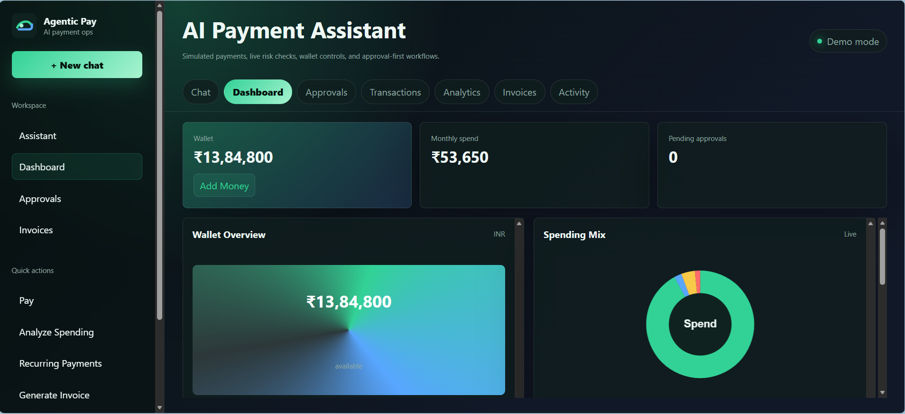
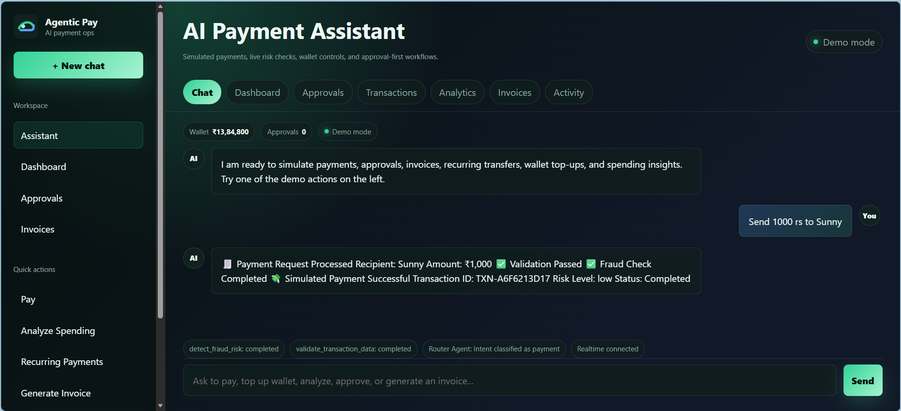
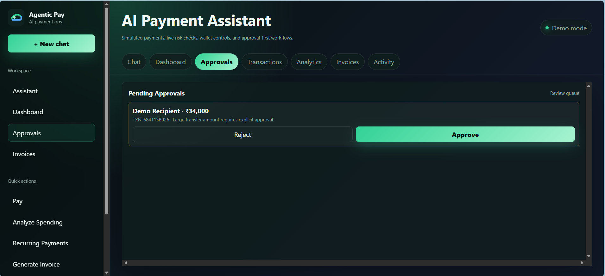
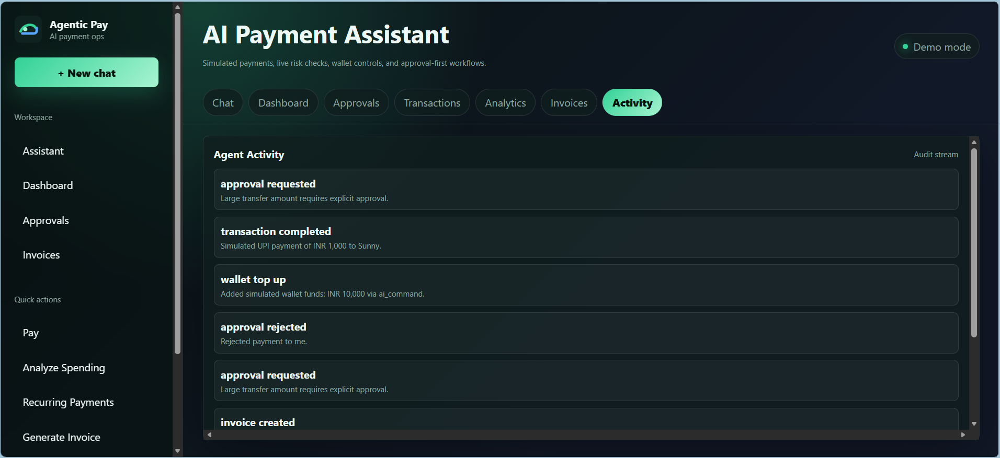
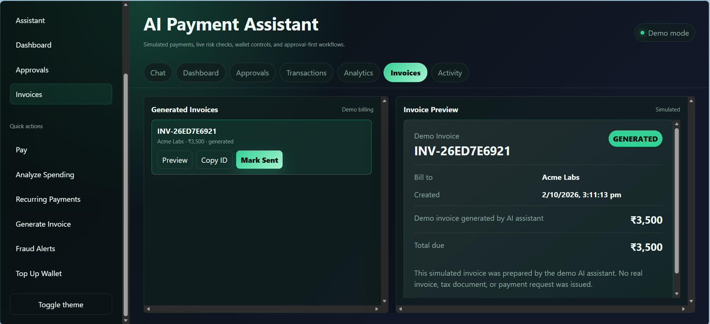

# Agentic AI Payment Assistant

A full-stack payment assistant demo combining a FastAPI backend, agent orchestration, SQLite persistence, WebSocket streaming, and a vanilla HTML/CSS/JavaScript frontend.

All payments are simulated. The app does not integrate with banks and does not move real money.

## What You Can Do

- Chat with an AI-style payment assistant for simulated transfers, wallet top-ups, invoices, recurring payments, and spending analysis.
- Simulate normal payments such as `Pay INR 500 to Rahul`.
- Trigger high-risk payment review with prompts such as `Transfer INR 20,000 to unknown account`.
- Review risky transfers from the Approvals tab instead of approving them inline.
- Add simulated funds to the wallet from the UI or with `Add INR 5000 to wallet`.
- Generate simulated invoices and preview them from the Invoices tab.
- View transaction history, wallet balance, monthly spend, fraud insights, recommendations, audit logs, and dashboard charts.
- Run the demo with or without an LLM API key.

## Tech Stack

- **Backend:** Python, FastAPI, SQLAlchemy
- **AI/Agentic AI:** LangChain, LLMs, Agent Orchestration
- **Database:** SQLite
- **Frontend:** HTML, CSS, JavaScript
- **Communication:** REST APIs, WebSockets
- **Security:** Input validation, prompt-injection guardrails, rate limiting
- **Deployment:** Docker, Docker Compose

## Architecture

```text
Frontend (HTML/CSS/JavaScript)
              │
        REST / WebSocket
              │
              ▼
       FastAPI Backend
              │
              ▼
      Agent Orchestrator
       ┌──────┼──────┐
       ▼      ▼      ▼
    Router  Validation  Fraud
     Agent    Agent     Agent
       │
       ▼
    Services
       │
       ▼
 SQLite Database
```

- `backend/app/main.py`: FastAPI app, CORS, routers, WebSocket route, static frontend serving.
- `backend/app/agents`: LangChain-compatible orchestration, tools, routing, validation, fraud, budget, and payment agents.
- `backend/app/services`: payment simulation, analytics, invoice, notifications, and audit services.
- `backend/app/models.py`: SQLite tables for users, sessions, chats, transactions, approvals, audit logs, recurring payments, and wallets.
- `frontend`: responsive SaaS dashboard, ChatGPT-style assistant, charts, timeline, approvals, theme toggle, and realtime updates.
- `docker`: lightweight Dockerfiles and Compose setup.

## How It Works

1. The vanilla JS frontend opens a demo session and connects to `/ws/chat/{session_id}`.
2. Chat messages are streamed to the FastAPI backend over WebSocket.
3. The router agent classifies intent: payment, analytics, invoice, recurring payment, wallet top-up, or general help.
4. Validation and fraud checks run before any simulated payment is created.
5. Low-risk payments complete immediately and update the SQLite wallet and transaction tables.
6. High-risk payments are paused, written to the approvals table, and shown in the Approvals tab.
7. Dashboard, Analytics, Transactions, Activity, and Chat views refresh from REST APIs.
8. Audit logs record top-ups, approvals, blocked prompt-injection attempts, invoices, and simulated payment events.

The backend is intentionally lightweight: FastAPI routers call service functions, services update SQLite through SQLAlchemy async sessions, and the frontend receives live workflow updates through WebSocket events.

## Quick Start

On Windows PowerShell:

```powershell
cd backend
py -m venv .venv
.venv\Scripts\Activate.ps1
pip install -r requirements.txt
Copy-Item .env.example .env
uvicorn app.main:app --reload
```

On macOS or Linux:

```bash
cd backend
python3 -m venv .venv
source .venv/bin/activate
pip install -r requirements.txt
cp .env.example .env
uvicorn app.main:app --reload
```

Open the app at [http://localhost:8000](http://localhost:8000).

The local `.env` file and SQLite database are intentionally excluded from Git. The app uses a project-relative database path by default. To serve the frontend separately:

```bash
cd agentic-payments-demo/frontend
python -m http.server 3000
```

When served on port `3000`, the frontend calls the backend at `http://localhost:8000`.

## LLM Configuration

The assistant works without an API key using a deterministic fallback. To enable OpenAI-compatible streaming, set:

```env
LLM_PROVIDER=openai-compatible
LLM_BASE_URL=https://api.openai.com/v1
LLM_API_KEY=your_key
LLM_MODEL=gpt-4o-mini
```

Any OpenAI-compatible provider can be used by changing `LLM_BASE_URL`, `LLM_API_KEY`, and `LLM_MODEL`.

Keep real credentials in `backend/.env`, never in source files. If `LLM_API_KEY` is blank, the app still works. The local orchestrator performs intent routing, validation, fraud scoring, wallet updates, approval creation, and fallback response streaming without calling an external model. Set a unique `SECRET_KEY` before deploying anywhere beyond a local demo.

## API Documentation

FastAPI docs are available at [http://localhost:8000/docs](http://localhost:8000/docs).

Core routes:

- `POST /api/session/create`
- `GET /api/chat/history/{session_id}`
- `POST /api/chat/send`
- `GET /api/dashboard/{session_id}`
- `GET /api/transactions/{session_id}`
- `POST /api/transactions/simulate`
- `POST /api/approvals/{approval_id}/decision`
- `GET /api/analytics/spending/{session_id}`
- `GET /api/insights/{session_id}`
- `POST /api/recurring/create`
- `POST /api/invoice/create`
- `POST /api/wallet/top-up`

## WebSocket Usage

Connect to:

```text
ws://localhost:8000/ws/chat/{session_id}
```

Send:

```json
{ "message": "Pay INR 500 to Rahul" }
```

The stream emits these event types:

- `agent`: agent status, such as router classification.
- `tool`: validation or fraud-check status.
- `token`: streamed assistant text.
- `transaction`: simulated payment result.
- `approval`: high-risk transaction added to the approval queue.
- `analytics`: spending summary and chart data.
- `invoice`: simulated invoice payload.
- `recurring`: recurring payment setup result.
- `wallet`: simulated wallet top-up result.
- `final`: final assistant response for the turn.

## Demo Walkthrough

Try these prompts:

- `Pay INR 500 to Rahul`
- `Transfer INR 20,000 to unknown account`
- `Show my spending this month`
- `Create weekly recurring payment of INR 750 to Workspace Tools`
- `Generate invoice for INR 3500 to Acme Labs`
- `Create an invoice from my latest transaction`
- `Who do I pay most often?`
- `Give me spending advice`
- `Add INR 5000 to wallet`

Risky payments are added to the Approvals tab. Approving or rejecting updates the simulated transaction, wallet, dashboard, and audit log.
Wallet top-ups are simulated, audited, and excluded from spending analytics.
Generated invoices appear in the Invoices tab with a preview card, invoice ID copy action, and simulated sent status.

## Main Features

- **Chat Assistant**: ChatGPT-style interface with streaming responses and live agent/tool chips.
- **Dashboard**: Wallet overview, monthly spend, recent transactions, pending approvals, and spending chart.
- **Approvals**: Central queue for high-risk payments requiring review.
- **Transactions**: Timeline of completed, rejected, and approval-required simulated transactions.
- **Analytics**: Category breakdown, AI-style recommendations, and fraud insights.
- **Wallet Top-Up**: Simulated Add Money modal and AI command support.
- **Invoices**: Demo invoice payload generation.
- **Invoice Preview**: Invoices tab with generated invoice cards, preview, copy ID, and simulated Mark Sent controls.
- **Recurring Payments**: Simulated weekly or monthly payment setup.
- **Audit Logs**: Activity stream for sensitive or important workflow events.

## Screenshots

### Dashboard



### AI Payment Assistant



### Approval Workflow



### Agent Activity



### Invoices



## Security And Guardrails

- Blocks prompt injection phrases such as `ignore previous instructions` and `reveal system prompt`.
- Requires approvals for large transfers, unknown recipients, and suspicious risk scores.
- Sanitizes user text and validates payloads.
- Limits request rate per session.
- Stores audit logs for approvals, suspicious actions, rejected actions, invoices, and guardrail blocks.

## Troubleshooting

- **`greenlet` is missing**: run `pip install greenlet==3.1.1` inside `backend/.venv`, or rerun `pip install -r requirements.txt`.
- **SQLite cannot open database file**: confirm `DATABASE_URL` in `backend/.env` points to `agentic-payments-demo/data/demo.sqlite3`.
- **Frontend looks stale**: hard refresh the browser after CSS/JS changes.
- **Backend is not responding**: start it from `backend` with `uvicorn app.main:app --reload`.
- **No LLM key configured**: this is fine for the demo; fallback orchestration still works.
- **Charts look wrong after resizing**: switch tabs or refresh; charts redraw when Dashboard or Analytics becomes active.

## Docker

```bash
cd agentic-payments-demo/docker
docker-compose up --build
```

Frontend: [http://localhost:3000](http://localhost:3000)  
Backend: [http://localhost:8000](http://localhost:8000)
